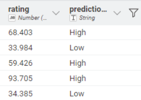
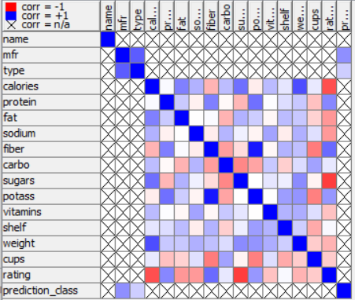
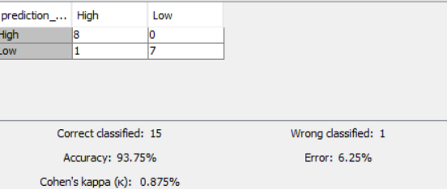
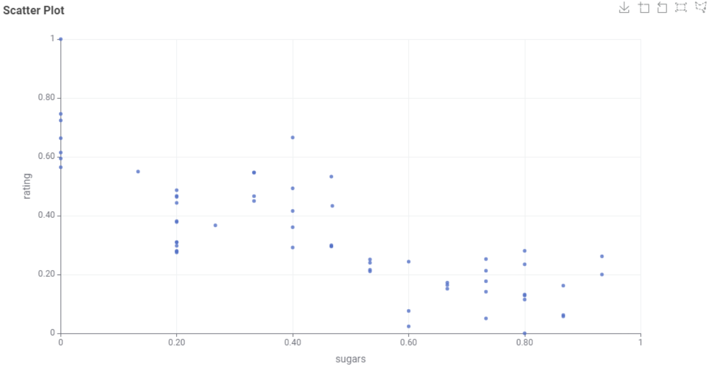
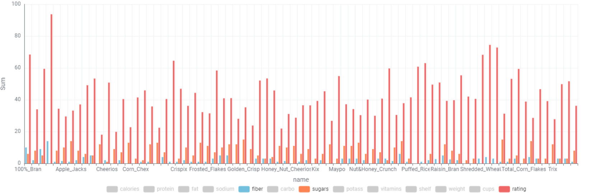
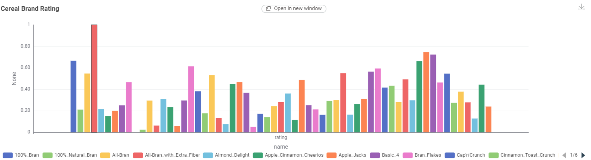

# Project DAE

* C14220004 - Bryan Mogens Warren
* C14220011 - Christoper Bintang Augurius

# Laporan Akhir Project Data Analytics: Analisis Prediksi Rating Sereal

## 1. Pendahuluan

Industri makanan, khususnya sereal sarapan, memiliki variasi produk yang sangat luas dengan klaim kesehatan yang beragam. Dalam proyek ini, kelompok kami bertujuan untuk menganalisis dataset `Cereals.csv` guna membongkar pola tersembunyi di balik penilaian (rating) konsumen.

Tujuan utama dari proyek ini adalah membangun model Machine Learning yang dapat memprediksi apakah sebuah produk sereal akan mendapatkan rating "High" atau "Low" hanya dengan melihat label nutrisinya, serta memahami faktor apa yang paling krusial dalam penentuan rating tersebut.

## 2. Metodologi Penelitian

Kami menggunakan pendekatan Cross-Industry Standard Process for Data Mining (CRISP-DM) yang diimplementasikan menggunakan KNIME Analytics Platform. Berikut adalah alur kerja (workflow) yang kami bangun:

### A. Data Understanding & Preprocessing

Data mentah terdiri dari 77 jenis sereal dengan 16 atribut (kalori, protein, lemak, sodium, serat, gula, dll).

* **Penanganan Missing Values:** Kami menemukan kekosongan data pada kolom `carbo`, `sugars`, dan `potass`. Kami memutuskan untuk melakukan imputasi menggunakan nilai Median agar tidak merusak distribusi data jika ada outlier.
* **Feature Engineering:** Kami mengubah kolom target `rating` (numerik) menjadi kategorial (biner).

  

  * *Threshold:* Nilai median rating (40).
  * *Kelas:* "High Rating" (> 40) dan "Low Rating" (≤ 40).
* **Normalisasi:** Menggunakan node `Normalizer` (Min-Max Scaling) untuk menyamakan skala data numerik agar fitur dengan angka besar (seperti sodium) tidak mendominasi fitur angka kecil (seperti fiber).

### B. Pemisahan Data (Partitioning)

Agar evaluasi model objektif, kami membagi data menggunakan node `Partitioning` dengan rasio:

* **80% Training Set:** Data untuk melatih model mempelajari pola.
* **20% Testing Set:** Data untuk menguji seberapa akurat prediksi model.

### C. Pemodelan

Kami memilih algoritma Decision Tree karena keunggulannya dalam interpretabilitas. Hasil model ini berupa pohon keputusan yang mudah dibaca manusia menjadi aturan bisnis (business rules).

---

## 3. Hasil Analisis dan Pembahasan

### A. Analisis Korelasi (Linear Correlation)

Sebelum masuk ke prediksi, kami menganalisis hubungan antar variabel. Temuan kuncinya adalah:

1. **Musuh Utama Rating adalah Gula:** Korelasi antara `sugars` dan `rating` adalah -0.76. Ini adalah hubungan negatif yang sangat kuat.
2. **Sahabat Rating adalah Serat:** Korelasi antara `fiber` dan `rating` adalah +0.58.
3. **Kalori Berdampak Negatif:** Kalori juga memiliki korelasi negatif cukup kuat (-0.69), yang masuk akal karena gula menyumbang kalori.

### B. Evaluasi Performa Model

Berdasarkan pengujian pada data test (20% data), berikut adalah performa model Decision Tree kami:

* **Akurasi Global:** ~93.75%

  Model mampu menebak dengan benar 15 dari 16 kasus.
* **Analisis Confusion Matrix:**

  * Model sangat baik dalam mengenali sereal "Low Rating" (sedikit kesalahan).
  * Terdapat sedikit False Negatif (Sereal bagus yang diprediksi jelek), namun jumlahnya minim.
* **Feature Importance (Tingkat Kepentingan Variabel):**

  Model menganggap variabel berikut paling penting dalam memisahkan rating:

  1. **Sugars (76.7%)** - Dominan
  2. **Vitamins (8.7%)**
  3. **Potass (5.4%)**

---

## 4. Interpretasi Bisnis & Insight Mendalam

Dari hasil "pohon keputusan" yang dihasilkan model, kami menerjemahkannya menjadi wawasan bisnis yang praktis:

### Insight 1: Golden Rule "7.5 Gram"

Kami menemukan ambang batas psikologis yang jelas pada data:

> "Sereal dengan kandungan gula > 7.5 gram per sajian memiliki probabilitas sangat tinggi untuk jatuh ke kategori Low Rating."

Ini memberikan indikasi bahwa konsumen (atau badan pemberi rating) sangat sensitif terhadap kandungan gula. Produk di atas ambang batas ini dianggap sebagai "permen berkedok sarapan".

### Insight 2: Peran Serat sebagai Penyelamat

Jika sebuah produk terpaksa memiliki gula agak tinggi (di atas rata-rata), satu-satunya cara untuk tetap mendapatkan rating baik adalah dengan mendongkrak kandungan Serat (Fiber) secara drastis (di atas 4.5 gram). Tanpa serat, produk manis tidak memiliki harapan untuk mendapatkan skor tinggi.

### Insight 3: Mapping Persaingan Produsen

* **Nabisco (N)** adalah market leader dalam kualitas. Strategi mereka fokus pada produk gandum utuh (shredded wheat) yang minim gula.
* **General Mills (G)** dan **Kellogg's (K)** memiliki portofolio yang campur aduk, namun rata-ratanya terseret turun oleh banyaknya produk sereal anak-anak yang tinggi gula.

Merk berdasarkan kolom `mfr` pada dataset

---

## 5. Kesimpulan dan Rekomendasi

### Kesimpulan

Berdasarkan analisis kelompok kami, dapat disimpulkan bahwa Rating Sereal bukanlah soal rasa, melainkan soal profil kesehatan. Variabel `sugars` adalah prediktor tunggal terkuat. Model Decision Tree yang kami bangun sudah cukup andal untuk digunakan sebagai alat bantu prediksi awal bagi tim R&D sebelum meluncurkan produk.

### Keterbatasan (Limitations)

Kami menyadari analisis ini memiliki keterbatasan:

1. **Ukuran Dataset:** Jumlah data hanya 77 baris, yang tergolong kecil untuk Machine Learning.
2. **Faktor Eksternal:** Kami hanya menganalisis faktor nutrisi, padahal rating juga bisa dipengaruhi oleh harga, branding, atau tekstur yang tidak ada dalam data ini.

### Rekomendasi Strategis

Untuk meningkatkan daya saing produk sereal, kami menyarankan:

1. **Product Development:** Tetapkan KPI ketat bahwa gula tidak boleh melebihi 7 gram per sajian.
2. **Marketing:** Gunakan klaim "High Fiber" atau "No Added Sugar" secara agresif di kemasan depan, karena ini berkorelasi langsung dengan persepsi kualitas.
3. **Kompetisi:** Hindari berkompetisi di segmen "sereal manis rendah serat" karena segmen ini sudah jenuh dan memiliki persepsi rating yang buruk.
